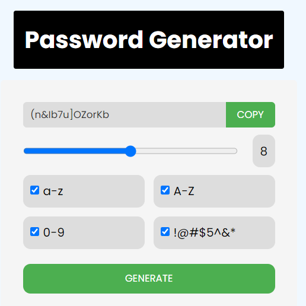

# Password Generator App 🔒

A simple and user-friendly password generator app that allows users to generate secure passwords with customizable options. Users can select the types of characters to include in the password and adjust the length of the generated password using a slider.

## App link

https://password-generator-app-using-js.netlify.app/

## Demo

https://github.com/user-attachments/assets/8f256922-8733-47d6-8b06-3185fcba6ebf

## Features

- **Password Generation**: Generate a secure password based on selected criteria.
- **Customizable Options**: Include lowercase letters, uppercase letters, digits, and symbols.
- **Adjustable Length**: Set the length of the password using a range slider.
- **Copy to Clipboard**: Copy the generated password to the clipboard with a single click.
- **Real-time Update**: The password updates in real-time as options or length changes.

## Files Included

- `index.html`: The main HTML file containing the structure and elements of the app.
- `style.css`: The CSS file for styling the app's layout and appearance.
- `script.js`: The JavaScript file that handles the password generation logic and interactions.

## How to Use

1. **Clone or Download**: Clone this repository or download the ZIP file and extract it.
2. **Open `index.html`**: Open the `index.html` file in your web browser.
3. **Select Options**: Choose the character types you want to include in the password (lowercase, uppercase, digits, symbols).
4. **Adjust Length**: Use the range slider to set the desired password length.
5. **Generate Password**: Click the "Generate" button to create a password based on your selections.
6. **Copy Password**: Click the "copy" button to copy the generated password to your clipboard.

## How It Works

- **HTML**: The structure is defined in `index.html`, including input fields, buttons, and display elements.
- **CSS**: The visual style is applied in `style.css`, including layout, colors, and button styles.
- **JavaScript**: The logic for password generation, event handling, and clipboard operations is implemented in `script.js`.

## Customization

- **Change Options**: Modify the available options by editing the checkboxes and labels in `index.html`.
- **Adjust Style**: Customize the look and feel by updating `style.css`.
- **Update Logic**: Modify the password generation rules and logic in `script.js`.

## Example

When you select different options and adjust the length, the password is generated and displayed in real-time. You can copy the password to your clipboard by clicking the "copy" button.

## Acknowledgements

- This app uses the [Poppins](https://fonts.google.com/specimen/Poppins) font from Google Fonts for a clean and modern look.
